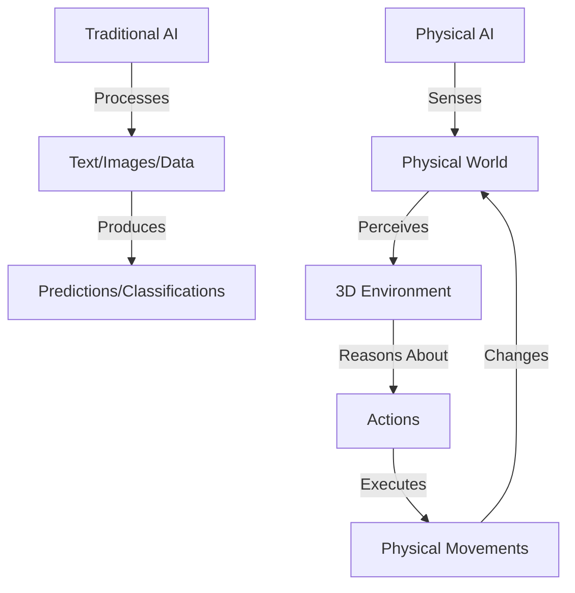
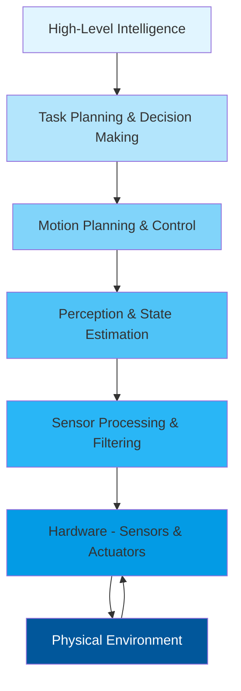

# Chapter 1: Introduction to Physical AI

## Learning Objectives

By the end of this chapter, you will be able to:

- Define Physical AI and explain its relationship to embodied intelligence
- Understand the key differences between traditional AI and Physical AI
- Identify real-world applications of Physical AI in humanoid robotics
- Recognize the fundamental challenges in building intelligent physical systems
- Appreciate the interdisciplinary nature of Physical AI development

## What is Physical AI?

**Physical AI** refers to artificial intelligence systems that interact with and learn from the physical world through sensors, actuators, and embodied experiences. Unlike traditional AI that operates purely in digital environments (processing text, images, or structured data), Physical AI must understand and manipulate the three-dimensional world we inhabit.

### Key Characteristics of Physical AI

1. **Embodiment**: The AI is instantiated in a physical form (robot, vehicle, drone) with a body that interacts with the environment
2. **Real-time Perception**: Continuous sensory input from cameras, LIDAR, tactile sensors, IMUs, and other modalities
3. **Action-Consequence Learning**: The system learns from the outcomes of its physical actions
4. **Environmental Interaction**: Direct manipulation of objects and navigation through real-world spaces
5. **Physics-Aware Reasoning**: Understanding constraints like gravity, friction, inertia, and material properties

### Physical AI vs. Traditional AI

| Aspect | Traditional AI | Physical AI |
|--------|---------------|-------------|
| **Environment** | Digital (data, text, images) | Physical world (3D space, objects) |
| **Perception** | Structured input (files, databases) | Continuous sensor streams (cameras, LIDAR) |
| **Action** | Symbolic outputs (predictions, classifications) | Physical movements (manipulation, navigation) |
| **Learning** | Supervised/unsupervised from datasets | Embodied learning through interaction |
| **Constraints** | Computational resources | Physics, safety, real-time requirements |
| **Feedback Loop** | Offline evaluation metrics | Real-world consequences (success/failure) |



## Why Physical AI Matters

### The Embodied Intelligence Hypothesis

Human intelligence evolved not in isolation, but through continuous interaction with the physical world. Our cognitive abilities—reasoning, planning, language—are deeply rooted in sensorimotor experiences. The **embodied intelligence hypothesis** suggests that true general intelligence may require a physical body to develop rich, grounded understanding.

> "Intelligence requires a body to interact with the world, not just a brain to process information." — Rodney Brooks, Robotics Pioneer

### Real-World Impact

Physical AI is transforming industries and addressing critical challenges:

**1. Healthcare & Assistance**
- Surgical robots performing minimally invasive procedures with superhuman precision
- Assistive robots helping elderly and disabled individuals with daily tasks
- Rehabilitation robots providing personalized physical therapy

**2. Manufacturing & Logistics**
- Warehouse robots (Amazon, Alibaba) handling millions of items daily
- Collaborative robots (cobots) working alongside humans on assembly lines
- Autonomous material handling in factories and distribution centers

**3. Agriculture**
- Harvesting robots identifying ripe produce and picking with care
- Autonomous tractors and drones for precision agriculture
- Plant monitoring systems detecting diseases and optimizing irrigation

**4. Exploration**
- Mars rovers navigating alien terrain and conducting scientific experiments
- Underwater robots exploring ocean depths inaccessible to humans
- Search and rescue robots entering disaster zones too dangerous for responders

**5. Domestic & Service**
- Cleaning robots (Roomba, Dyson) adapting to home layouts
- Delivery robots navigating sidewalks and campuses
- Security and inspection robots patrolling facilities

## Fundamental Challenges in Physical AI

Building intelligent physical systems is fundamentally harder than developing traditional AI. Here are the core challenges:

### 1. The Sim-to-Real Gap

**Challenge**: Models trained in simulation often fail in the real world due to differences in physics, sensor noise, and environmental variability.

**Why It Matters**: Simulations are essential for training (safety, speed, cost), but reality is messier—lighting changes, surfaces vary, objects behave unpredictably.

**Approaches**:
- **Domain randomization**: Training with extreme variability in simulation
- **System identification**: Measuring and modeling real-world physics parameters
- **Fine-tuning**: Adapting sim-trained models with real-world data
- **Digital twins**: High-fidelity simulations matched to specific real systems

```python
# Example: Domain randomization for robust object detection
import numpy as np

def randomize_simulation_params():
    """Randomize simulation parameters during training"""
    return {
        'lighting_intensity': np.random.uniform(50, 1000),  # lux
        'surface_friction': np.random.uniform(0.1, 0.9),    # coefficient
        'object_mass': np.random.uniform(0.05, 2.0),        # kg
        'camera_exposure': np.random.uniform(0.01, 0.1),    # seconds
        'object_texture': np.random.choice(['smooth', 'rough', 'glossy']),
    }
```

### 2. Real-Time Constraints

**Challenge**: Physical systems must perceive, reason, and act within strict time limits—often 10-100ms—or risk failure.

**Why It Matters**: A self-driving car can't take 5 seconds to decide whether to brake. A humanoid robot must balance continuously or fall.

**Approaches**:
- **Edge computing**: On-robot processing with GPUs/TPUs
- **Hierarchical architectures**: Fast reactive layers + slow deliberative layers
- **Model compression**: Quantization, pruning, knowledge distillation
- **Hardware acceleration**: Custom ASICs for inference

### 3. Safety and Robustness

**Challenge**: Robots operate in unstructured environments with humans nearby. Failures can cause physical harm.

**Why It Matters**: Unlike software bugs that cause app crashes, robotics failures can injure people or damage property.

**Approaches**:
- **Formal verification**: Mathematically proving safety properties
- **Redundancy**: Backup systems for critical components
- **Fail-safe mechanisms**: Emergency stops, soft materials, force limiting
- **Extensive testing**: Simulation, staged real-world validation

### 4. Generalization and Adaptation

**Challenge**: Real-world environments are infinitely diverse. A robot trained in one setting may fail in another.

**Why It Matters**: We can't pre-program responses to every situation. Systems must adapt on the fly.

**Approaches**:
- **Transfer learning**: Leveraging knowledge from related tasks
- **Meta-learning**: Learning to learn new tasks quickly
- **Continual learning**: Updating models without forgetting previous knowledge
- **Foundation models**: Large pre-trained models (like VLAs) with broad capabilities

### 5. Multimodal Integration

**Challenge**: Robots must fuse information from diverse sensors—cameras, LIDAR, IMUs, force sensors—each with different characteristics.

**Why It Matters**: No single sensor provides complete information. Vision can't measure distance accurately, LIDAR can't identify objects, etc.

**Approaches**:
- **Sensor fusion algorithms**: Kalman filters, particle filters
- **Multimodal deep learning**: Neural networks processing multiple input types
- **Attention mechanisms**: Dynamically weighting sensor inputs based on reliability

## The Physical AI Technology Stack

Building a Physical AI system requires integrating multiple layers:



### Layer 1: Hardware (Foundation)
- **Sensors**: Cameras, LIDAR, IMUs, force/torque sensors, encoders
- **Actuators**: Motors, servos, hydraulics, pneumatics
- **Compute**: Embedded processors, GPUs, ASICs

### Layer 2: Low-Level Processing
- Signal processing and filtering
- Sensor calibration and alignment
- Motor control and feedback loops

### Layer 3: Perception & Estimation
- Object detection and tracking
- Depth estimation and 3D reconstruction
- Localization and mapping (SLAM)
- State estimation (position, velocity, orientation)

### Layer 4: Motion Planning & Control
- Trajectory generation
- Inverse kinematics
- Collision avoidance
- Balance and stability control

### Layer 5: High-Level Intelligence
- Task planning and sequencing
- Decision making under uncertainty
- Learning from demonstrations
- Natural language understanding (for human-robot interaction)

## Physical AI and Humanoid Robotics

**Humanoid robots**—robots with human-like form—represent one of the most ambitious applications of Physical AI. Why humanoids?

### Advantages of Humanoid Form

1. **Human-Designed Environments**: Our world is built for human bodies—stairs, doorknobs, tools, furniture. Humanoid robots can navigate these spaces without redesign.

2. **Intuitive Interaction**: Humans naturally understand humanoid behavior (waving, nodding, gesturing), enabling more natural communication.

3. **Versatility**: A general-purpose form factor can perform diverse tasks—unlike specialized robots designed for single functions.

4. **Empathy and Acceptance**: People are more comfortable with human-like robots in social settings (healthcare, education, service).

### Challenges Unique to Humanoids

1. **Bipedal Locomotion**: Walking on two legs is inherently unstable—requires continuous dynamic balancing.

2. **Dexterous Manipulation**: Human hands have 27 degrees of freedom. Replicating this dexterity is mechanically and computationally challenging.

3. **Power Efficiency**: Biological systems are remarkably energy-efficient. Current humanoid robots consume 10-100x more power per kg than humans.

4. **Uncanny Valley**: Near-human appearance can trigger psychological discomfort if not executed perfectly.

## Case Study: Boston Dynamics Atlas

Let's examine a state-of-the-art humanoid: **Boston Dynamics Atlas**.

**Specifications**:
- Height: 1.5m (5 ft)
- Weight: 89 kg (196 lbs)
- Degrees of Freedom: 28
- Sensors: LIDAR, stereo cameras, IMU, force/torque sensors
- Power: Battery-powered (up to 60 minutes runtime)

**Capabilities**:
- Dynamic balance and recovery from pushes
- Parkour (jumping, flipping, precise landings)
- Object manipulation (picking up and carrying boxes)
- Navigation over rough terrain

**Key Technologies**:
- **Model Predictive Control (MPC)**: Predicting future states to plan optimal movements
- **Whole-Body Control**: Coordinating all joints simultaneously for complex maneuvers
- **Real-Time Perception**: Processing sensor data at 100Hz+ for reactive behavior
- **Sim-to-Real Transfer**: Extensive simulation training before real-world deployment

**What Makes It Work**:
1. Hydraulic actuators providing high power-to-weight ratio
2. Advanced state estimation fusing multiple sensor modalities
3. Hierarchical control (high-level planning + low-level stabilization)
4. Years of iterative hardware and software refinement

## The Road Ahead: Vision-Language-Action Models

The latest frontier in Physical AI is **Vision-Language-Action (VLA) models**—systems that:
- **See**: Perceive the world through cameras and sensors
- **Understand**: Interpret natural language instructions
- **Act**: Execute appropriate physical actions

Example: "Pick up the red cup on the table and place it in the sink."

VLA models combine:
- **Computer vision** (detecting "red cup", "table", "sink")
- **Natural language processing** (parsing the instruction)
- **Motion planning** (generating a grasp and trajectory)
- **Control** (executing the movement)

We'll explore VLAs in depth in **Module 5**.

## Summary

Physical AI represents a paradigm shift in artificial intelligence—moving from purely digital reasoning to systems that understand and act in the physical world. Key takeaways:

✅ **Physical AI requires embodiment**: Intelligence grounded in physical interaction
✅ **Real-world deployment is hard**: Sim-to-real gap, safety, real-time constraints
✅ **Humanoids are versatile but challenging**: Natural for human environments, complex to control
✅ **Interdisciplinary field**: Combines AI, robotics, control theory, perception, mechanics
✅ **Rapid progress**: VLA models and foundation models are accelerating capabilities

In the next chapter, we'll dive deeper into **embodied intelligence**—the theory that physical experience is essential for developing general intelligence.

## Exercises

1. **Conceptual**: List three everyday human tasks that would be trivial for a traditional AI but extremely difficult for a Physical AI system. Explain why.

2. **Research**: Find a recent news article about a Physical AI application (healthcare, manufacturing, etc.). Identify which of the five fundamental challenges (sim-to-real, real-time, safety, generalization, multimodal) are most relevant to that application.

3. **Technical**: Consider a delivery robot navigating a busy sidewalk. List five different sensors it would need and explain what information each provides.

4. **Critical Thinking**: The "embodied intelligence hypothesis" suggests that physical bodies are necessary for true intelligence. Do you agree? Can you think of counter-examples (forms of intelligence that don't require physical embodiment)?

## Further Reading

- **Books**:
  - *Behavior-Based Robotics* by Ronald Arkin
  - *Probabilistic Robotics* by Sebastian Thrun et al.
  - *Robot Ethics 2.0* by Patrick Lin et al.

- **Papers**:
  - "The Role of Embodiment in the Development of Intelligence" (Pfeifer & Bongard, 2006)
  - "Sim-to-Real Transfer in Deep Reinforcement Learning for Robotics" (Peng et al., 2018)

- **Videos**:
  - Boston Dynamics: Atlas and Spot demos (YouTube)
  - TED Talk: "The Next Generation of Robots" by Daniela Rus

---

**Next Chapter**: [Embodied Intelligence](/docs/modules/foundations/chapter-02-embodied-intelligence) — Exploring the theory and neuroscience behind learning through physical interaction.
