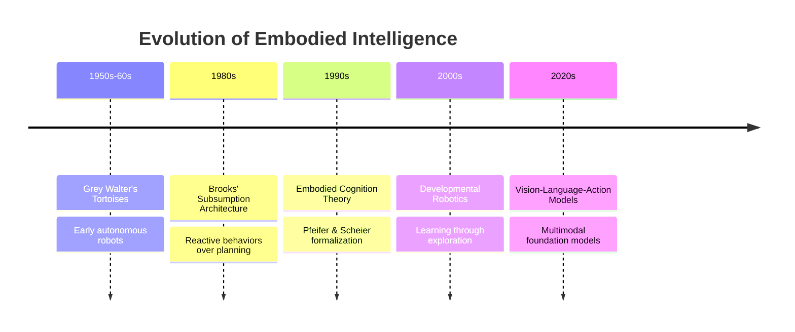
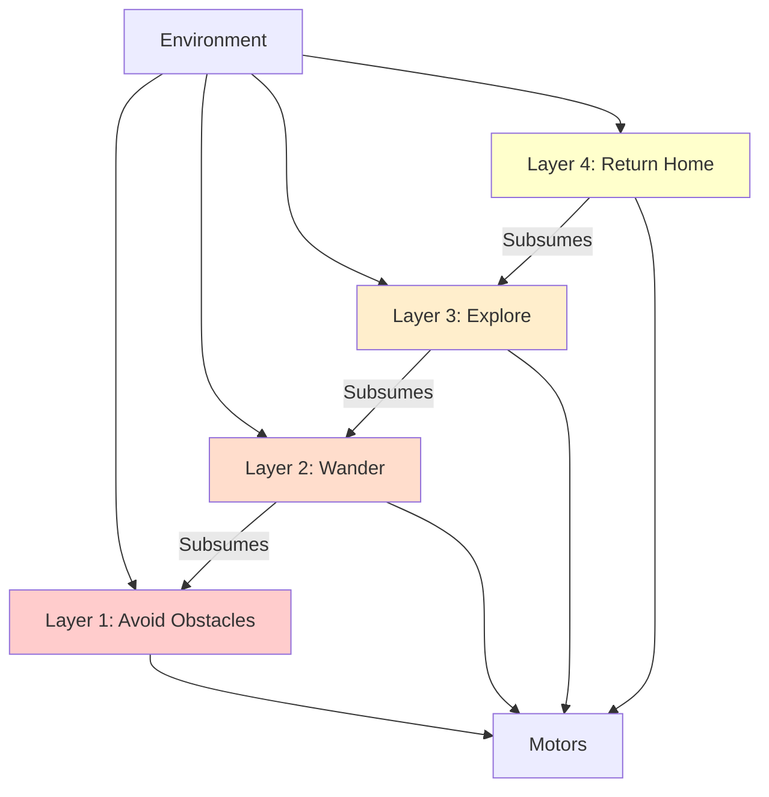
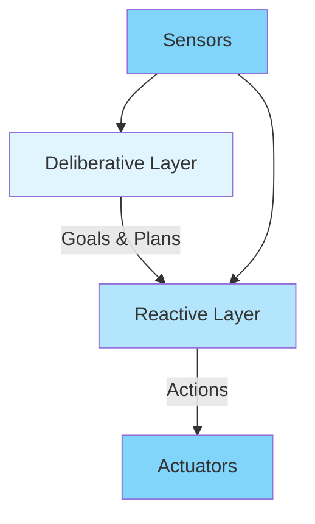

# Chapter 2: Embodied Intelligence

## Learning Objectives

By the end of this chapter, you will be able to:

- Explain the core principles of embodied intelligence and its theoretical foundations
- Understand the neuroscience behind sensorimotor learning in biological systems
- Recognize the limitations of disembodied AI approaches
- Apply embodied intelligence principles to robot design and control
- Evaluate the trade-offs between morphological and computational intelligence

## The Embodied Intelligence Paradigm

**Embodied intelligence** is the theory that intelligence arises from the interaction between an agent's body, brain, and environment. Rather than treating the mind as an abstract information processor (the traditional "AI as software" view), embodied intelligence emphasizes the crucial role of physical form, sensory experience, and motor action in shaping cognition.

### Core Principles

1. **Body Shapes Mind**: Physical morphology constrains and enables certain behaviors, influencing how an agent perceives and reasons about the world.

2. **Situated Action**: Intelligence emerges from real-time interaction with a specific environment, not from abstract symbol manipulation.

3. **Sensorimotor Coupling**: Perception and action are tightly linked—we don't just sense *then* act, but rather sense-act loops occur continuously.

4. **Morphological Computation**: The body itself performs computation through its physical structure (e.g., passive stability, mechanical compliance).

5. **Developmental Learning**: Intelligence unfolds through a developmental process—simple behaviors bootstrap more complex ones.

### Historical Context

The concept emerged as a reaction to **symbolic AI** (1950s-1980s), which focused on high-level reasoning with formal logic and knowledge representations, largely ignoring the physical world.

**Key Milestones**:
- **1950s-60s**: Grey Walter's autonomous robots (tortoises) exhibited lifelike behavior with simple circuits
- **1986**: Rodney Brooks proposes **subsumption architecture**—layered reactive behaviors instead of centralized planning
- **1991**: Pfeifer and Scheier's *Understanding Intelligence* formalizes embodied cognition theory
- **2000s**: Developmental robotics emerges—robots learning like infants through exploration
- **2020s**: Large multimodal models (VLAs) combine embodied interaction with language understanding



## Biological Foundations: How Animals Learn

To understand embodied intelligence, we must look at how biological systems develop intelligence through physical interaction.

### The Infant Development Analogy

Human infants don't start with abstract reasoning—they begin with:

1. **Reflexes** (0-2 months): Grasping, sucking, rooting—hardwired survival behaviors
2. **Sensorimotor Exploration** (2-7 months): Reaching, grasping, mouthing objects—learning object properties
3. **Intentional Action** (7-12 months): Goal-directed movement—crawling to reach a toy
4. **Tool Use** (12-18 months): Using objects as extensions of the body—banging a spoon
5. **Symbolic Thought** (18+ months): Language, imagination, planning—building on sensorimotor foundations

**Key Insight**: Abstract reasoning emerges *from* physical experience, not independently of it.

### Neuroscience: Mirror Neurons and Embodied Simulation

**Mirror neurons** (discovered 1990s in macaques) fire both when an animal performs an action *and* when it observes another performing the same action. This suggests:

- **Action understanding is grounded in motor knowledge**: We comprehend others' actions by internally simulating them using our own motor system.
- **Observation is embodied**: Watching someone grasp a cup activates the same neural circuits as actually grasping.

**Implications for AI**:
- Robots might understand actions better by *doing* them, not just observing
- Transfer learning could leverage motor experience from simulation or teleoperation
- Imitation learning is more natural when the imitator has a similar embodiment

```python
# Pseudo-code: Embodied action recognition
class EmbodiedActionRecognizer:
    def __init__(self, motor_repertoire):
        """
        Initialize with the robot's own motor skills.

        Args:
            motor_repertoire: Set of actions the robot can perform
        """
        self.motor_repertoire = motor_repertoire
        self.mirror_system = MirrorNeuralNetwork()

    def recognize_action(self, observed_action):
        """
        Recognize action by simulating it with own motor system.

        Args:
            observed_action: Visual sequence of another agent's movement

        Returns:
            action_label: Recognized action ("grasp", "push", etc.)
            confidence: How well internal simulation matches observation
        """
        # Simulate observed action using own motor system
        for action in self.motor_repertoire:
            simulated_trajectory = self.execute_internally(action)
            similarity = self.mirror_system.compare(
                observed_action, simulated_trajectory
            )
            if similarity > threshold:
                return action, similarity

        return "unknown_action", 0.0
```

### Case Study: Octopus Intelligence

The octopus provides a fascinating example of non-centralized intelligence:

- **Distributed nervous system**: 500 million neurons, but only 40 million in the brain—most intelligence is in the arms!
- **Autonomous limbs**: Each arm has ~40 million neurons and can solve problems independently
- **Morphological computation**: Soft body passively conforms to objects, reducing computational burden
- **No internal body map**: Unlike humans, octopuses don't have a fixed representation of their body—they adapt to their current configuration

**Lesson for Robotics**: Intelligence doesn't require centralized control. Distributed architectures with local autonomy can be more robust and efficient.

## Morphological Computation: When the Body Does the Thinking

**Morphological computation** is the idea that physical structure itself performs computation, offloading work from the "brain."

### Examples in Nature

1. **Passive Dynamic Walkers**: Bipedal robots with no motors that walk down slopes purely through mechanical design—gravity and inertia "compute" the gait.

2. **Compliant Grippers**: Soft rubber fingers that automatically conform to object shapes, eliminating the need for precise grasp planning.

3. **Insect Legs**: Cockroach legs have mechanical properties (spring-like joints, claws) that stabilize locomotion without active control.

### Engineering Applications

**Soft Robotics**:
- Pneumatic actuators that bend smoothly without precise positioning
- Gripper fingers made of flexible materials that "flow" around objects
- Inherently safe (won't injure humans on contact)

**Example: Yale OpenHand Project**:
- Underactuated fingers (fewer motors than joints)
- Mechanical compliance allows automatic grasping of diverse shapes
- Reduces control complexity from 10+ DOF to 1-2

```python
# Simplified model: Compliant gripper vs. Rigid gripper
class RigidGripper:
    def grasp(self, object_shape, object_size):
        """Traditional approach: Precise positioning required"""
        # Must compute exact finger positions for object geometry
        finger_positions = self.compute_inverse_kinematics(
            object_shape, object_size
        )
        # Requires accurate perception and control
        if not self.position_error < 1mm:
            return "GRASP_FAILED"
        return "GRASP_SUCCESS"

class CompliantGripper:
    def grasp(self, object_rough_location):
        """Morphological computation: Body does the work"""
        # Soft materials automatically conform to object
        self.close_fingers(target_force=10N)  # Force control only
        # No need for precise shape knowledge
        return "GRASP_SUCCESS" if self.contact_detected() else "GRASP_FAILED"
```

### Trade-Off: Morphological vs. Computational Intelligence

| Approach | Advantages | Disadvantages |
|----------|-----------|---------------|
| **Morphological** | Energy efficient, fast, robust | Limited adaptability, fixed behaviors |
| **Computational** | Flexible, learnable, generalizable | Energy intensive, slower, complex |

**Optimal Design**: Combine both—use morphology for common cases (walking, grasping), use computation for edge cases and adaptation.

## Embodied AI Architectures

How do we design AI systems that leverage embodiment? Several architectural approaches have emerged.

### 1. Subsumption Architecture (Brooks, 1986)

Layered reactive behaviors instead of centralized reasoning:



**Key Idea**: Higher layers can **subsume** (override) lower layers. No central planner—behavior emerges from layer interactions.

**Advantages**:
- Fast reaction (no planning bottleneck)
- Robust (layer failures don't crash the system)
- Easy to debug (layers are independent)

**Disadvantages**:
- Hard to achieve complex goals requiring long-term planning
- Emergent behavior can be unpredictable

### 2. Behavior-Based Robotics

Extension of subsumption with more sophisticated behaviors:

- **Motor schemas**: Parameterized motor primitives (reach, grasp, locomote)
- **Behavior arbitration**: Mechanisms for selecting which behavior to execute
- **Coordination**: Behaviors can cooperate (e.g., "follow wall" + "avoid obstacle")

**Example: Cleaning Robot**:
```python
# Behavior-based cleaning robot
class CleaningRobot:
    def __init__(self):
        self.behaviors = [
            BehaviorAvoidObstacle(priority=100),  # Highest priority
            BehaviorReturnToCharger(priority=50),
            BehaviorSpiralSearch(priority=30),
            BehaviorRandomWalk(priority=10)       # Lowest priority
        ]

    def control_loop(self):
        """Execute highest-priority active behavior"""
        while True:
            # Sense environment
            sensor_data = self.read_sensors()

            # Evaluate behavior preconditions
            active_behaviors = [
                b for b in self.behaviors if b.is_active(sensor_data)
            ]

            # Execute highest priority
            if active_behaviors:
                behavior = max(active_behaviors, key=lambda b: b.priority)
                action = behavior.compute_action(sensor_data)
                self.execute(action)
```

### 3. Hybrid Architectures

Combine reactive layers (fast, reflexive) with deliberative layers (slow, planning):



**Examples**:
- **Three-Layer Architecture** (Gat, 1998): Planner → Sequencer → Reactive Controller
- **Autonomous Mars Rovers**: Deliberate path planning (slow) + obstacle avoidance (fast)

### 4. Modern Deep Learning Approaches

Recent systems use end-to-end learning from sensors to actions:

**Imitation Learning**:
- Robot observes human demonstrations
- Learns policy mapping observations → actions
- Requires embodiment similarity (human demonstrator → humanoid robot)

**Reinforcement Learning**:
- Robot explores environment through trial and error
- Reward signal guides learning
- Embodied experience crucial (can't learn manipulation without a gripper)

**Vision-Language-Action (VLA)**:
- Multimodal models processing vision + language → actions
- Pre-trained on large-scale data, fine-tuned for specific embodiments
- Combines symbolic reasoning (language) with embodied control

## Embodiment and Sim-to-Real Transfer

Embodiment plays a critical role in bridging simulation and reality.

### Why Embodiment Matters for Sim-to-Real

1. **Physical Plausibility**: Simulated body must match real robot's mass distribution, joint limits, friction, etc.

2. **Sensorimotor Consistency**: Sensor placement and characteristics must be realistic

3. **Interaction Dynamics**: Contact forces, object physics, environmental variability

### Techniques Leveraging Embodiment

**Domain Randomization**:
```python
# Randomize physical parameters during sim training
def randomize_embodiment():
    return {
        'link_mass': np.random.uniform(0.8, 1.2) * nominal_mass,
        'joint_friction': np.random.uniform(0.1, 0.5),
        'sensor_noise_stddev': np.random.uniform(0.001, 0.01),
        'actuator_delay': np.random.uniform(0.01, 0.05),  # seconds
    }
```

**Curriculum Learning**:
- Start with simplified embodiment (e.g., point mass)
- Gradually increase realism (full articulated robot)
- Build robust policies incrementally

**Residual Learning**:
- Train base policy in simulation
- Fine-tune in real world to correct for embodiment mismatch
- Learn "residual" corrections rather than full policy from scratch

## Implications for Humanoid Robotics

Humanoid robots are the ultimate test of embodied intelligence principles.

### Why Humanoid Embodiment?

1. **World is Human-Centric**: Tools, furniture, architecture designed for human bodies
2. **Intuitive Interaction**: Humans understand humanoid gestures and behaviors naturally
3. **Learning from Human Data**: Can leverage human demonstrations (videos, teleoperation)
4. **Dexterous Manipulation**: Human hand morphology enables versatile object interaction

### Challenges of Humanoid Embodiment

1. **Bipedal Instability**: Walking on two legs is dynamically unstable—constant active balancing required
2. **High DOF**: 28+ joints to coordinate simultaneously
3. **Power Density**: Human muscles have 200W/kg specific power; current actuators ~50W/kg
4. **Sensory Richness**: Humans have ~100 million sensory receptors; replicating this is prohibitively expensive

### Design Philosophy: Morphological Simplification

Rather than perfectly mimicking human anatomy, use morphological computation to simplify:

- **Underactuated hands**: Fewer motors, compliant materials for automatic grasping
- **Passive ankle joints**: Springs absorb landing impacts without active control
- **Cable-driven limbs**: Reduce distal mass, improve power-to-weight ratio

**Example: Shadow Dexterous Hand**:
- 20 degrees of freedom (vs. 27 in human hand)
- Tendon-driven (like human hand)
- Force/torque sensors in each fingertip
- Enables diverse grasps despite simplified morphology

## Summary

Embodied intelligence fundamentally changes how we think about AI—intelligence is not abstract computation, but emerges from the dynamic interaction of body, brain, and world.

**Key Takeaways**:

✅ **Body shapes cognition**: Physical form constrains and enables behaviors
✅ **Morphological computation**: Structure performs computation, offloading brain
✅ **Developmental learning**: Intelligence unfolds through physical exploration
✅ **Architectures matter**: Subsumption, behavior-based, hybrid approaches leverage embodiment
✅ **Sim-to-real depends on embodiment fidelity**: Physical realism crucial for transfer

In the next chapter, we'll explore the **physics and dynamics of physical systems**—the mathematical foundations underlying robot control.

## Exercises

1. **Conceptual**: Explain how an infant learning to grasp objects demonstrates embodied intelligence principles. Which of the five core principles (body shapes mind, situated action, etc.) are most evident?

2. **Design Challenge**: Design a robot gripper for picking up fragile objects (eggs, wine glasses). Would you use morphological computation (compliant materials) or computational approaches (precise force control)? Justify your choice.

3. **Simulation**: Research the "passive dynamic walker" (Cornell, 2005). Explain how this demonstrates morphological computation. What are the limitations of this approach for practical robots?

4. **Code Analysis**: The `EmbodiedActionRecognizer` code snippet uses internal simulation for action recognition. How would this approach differ from a purely vision-based classifier (CNN on video frames)? What are the trade-offs?

5. **Critical Thinking**: Octopuses have distributed intelligence across their arms. Could a humanoid robot benefit from decentralized control? What tasks would be easier or harder with this approach?

## Further Reading

- **Books**:
  - *How the Body Shapes the Way We Think* by Rolf Pfeifer and Josh Bongard
  - *Vehicles: Experiments in Synthetic Psychology* by Valentino Braitenberg
  - *Flesh and Machines* by Rodney Brooks

- **Papers**:
  - "Intelligence without Representation" (Brooks, 1991) — Foundational subsumption architecture paper
  - "The Role of Embodiment in the Emergence of Systematic Generalizations in Artificial Grammar Learning" (Morse et al., 2010)
  - "Morphological Computation: Connecting Brain, Body, and Environment" (Hauser et al., 2012)

- **Videos**:
  - "The Role of Morphology in Locomotion" — MIT Leg Lab (YouTube)
  - "Soft Robotics: Grasping with Compliant Mechanisms" — Wyss Institute

---

**Next Chapter**: [Physical Systems and Dynamics](/docs/modules/foundations/chapter-03-physical-systems) — Mathematical foundations of robot motion and control.
