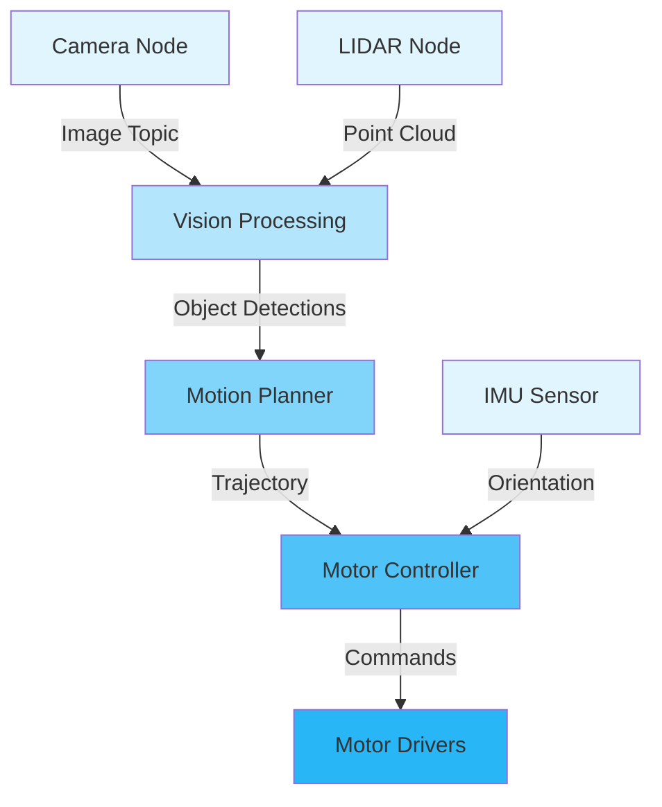
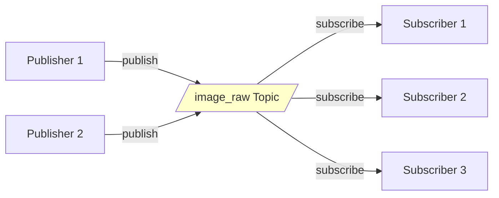

# Chapter 1: ROS 2 Introduction and Installation

## Learning Objectives

By the end of this chapter, you will be able to:

- Explain what ROS 2 is and why it's essential for modern robotics
- Understand the core architectural concepts: nodes, topics, services, and actions
- Install ROS 2 on Ubuntu, Windows (WSL2), or macOS (Docker)
- Create your first ROS 2 node with a publisher and subscriber
- Navigate the ROS 2 command-line interface (CLI) for debugging
- Understand the differences between ROS 1 and ROS 2

## What is ROS 2?

**ROS 2 (Robot Operating System 2)** is an open-source middleware framework for building complex robotic systems. Despite its name, it's not an operating system—it's a collection of software libraries and tools that run on top of standard operating systems (Linux, Windows, macOS) to help you build robot applications.

### Why "Robotic Nervous System"?

Think of ROS 2 as the nervous system of a robot:

- **Sensory Neurons** (Sensors) → Publish data to topics
- **Motor Neurons** (Actuators) → Subscribe to command topics
- **Brain** (Processing Nodes) → Transform sensor data into actions
- **Spinal Reflexes** (Reactive Behaviors) → Fast feedback loops
- **Nervous Pathways** (Communication Infrastructure) → Connect everything together

Just as biological nervous systems enable complex organisms to sense, process, and act, ROS 2 enables complex robots to coordinate distributed software components.



### Key Features of ROS 2

**1. Distributed Architecture**
- Multiple processes (nodes) communicate via standardized interfaces
- Nodes can run on different computers (distributed computing)
- Fault isolation: one node crashing doesn't bring down the system

**2. Language Agnostic**
- Official support for C++ and Python
- Community libraries for Rust, Java, and more
- Mix languages in the same system (Python for AI, C++ for control loops)

**3. Real-Time Capable**
- Unlike ROS 1, ROS 2 supports real-time computing
- Critical for control loops that must run at 100Hz, 1kHz, or faster
- Uses DDS (Data Distribution Service) for deterministic communication

**4. Production Ready**
- Used in commercial robots (autonomous vehicles, industrial robots, drones)
- Security features (encryption, authentication) for deployment
- Multi-platform: Linux, Windows, macOS

**5. Rich Ecosystem**
- Thousands of pre-built packages (perception, navigation, manipulation)
- Simulation tools (Gazebo, Isaac Sim integration)
- Visualization (RViz2) and debugging tools

## ROS 1 vs. ROS 2: Why the Upgrade?

| Feature | ROS 1 | ROS 2 |
|---------|-------|-------|
| **Architecture** | Master-based (single point of failure) | Distributed (peer-to-peer via DDS) |
| **Real-Time** | No | Yes (with RT-compatible DDS) |
| **Multi-Robot** | Difficult (namespace conflicts) | Native support |
| **Security** | None | TLS encryption, authentication |
| **Platforms** | Linux only | Linux, Windows, macOS |
| **Python** | Python 2.7 (deprecated) | Python 3.6+ |
| **Lifespan** | EOL in 2025 | Active development, long-term support |

**Bottom Line**: ROS 2 addresses fundamental limitations of ROS 1, making it suitable for production systems and safety-critical applications.

## Core Concepts: The ROS 2 Computation Graph

ROS 2 applications are structured as **computation graphs**—networks of nodes exchanging data.

### 1. Nodes

**Nodes** are individual processes that perform computation. Each node should have a single, well-defined purpose.

**Examples**:
- `camera_driver`: Publishes images from a camera
- `object_detector`: Subscribes to images, publishes detected objects
- `motion_planner`: Subscribes to object detections, publishes trajectories
- `motor_controller`: Subscribes to trajectories, controls motors

**Design Philosophy**:
- **Single Responsibility**: Each node does one thing well
- **Composability**: Combine nodes to build complex behaviors
- **Modularity**: Replace nodes without rewriting entire system

### 2. Topics

**Topics** are named buses over which nodes exchange messages.

- **Publishers** send messages to a topic
- **Subscribers** receive messages from a topic
- **Many-to-Many**: Multiple publishers and subscribers on one topic
- **Asynchronous**: Publishers don't wait for subscribers



**Example**: A camera node publishes images to `/camera/image_raw`. Multiple nodes (object detector, display tool, logger) subscribe to this topic.

### 3. Messages

**Messages** are data structures sent over topics. ROS 2 provides standard message types, and you can define custom ones.

**Common Message Types**:
- `std_msgs/String`: Simple text message
- `sensor_msgs/Image`: Camera image with metadata
- `geometry_msgs/Twist`: Linear and angular velocity (for mobile robots)
- `sensor_msgs/PointCloud2`: 3D LIDAR data

**Example Message Definition** (`geometry_msgs/Twist`):
```
Vector3 linear
  float64 x
  float64 y
  float64 z
Vector3 angular
  float64 x
  float64 y
  float64 z
```

### 4. Services

**Services** implement request-response patterns (like REST APIs).

- **Client** sends a request and waits for a response
- **Server** processes the request and returns a response
- **Synchronous**: Client blocks until response arrives
- **One-to-One**: Each request goes to a single server

**Example**: A `/set_camera_exposure` service that takes an exposure time and returns success/failure.

### 5. Actions

**Actions** are for long-running tasks that provide feedback.

- **Client** sends a goal
- **Server** executes the goal, providing periodic feedback
- **Asynchronous**: Client can cancel goals or wait for completion
- **Example**: Navigate to a destination (feedback: current progress, result: success/failure)

We'll explore services and actions in depth in Chapter 3.

## Summary

ROS 2 is the foundation for building modular, distributed robotic systems. Key takeaways:

✅ **ROS 2 is middleware**: Sits between OS and application code
✅ **Nodes communicate via topics**: Asynchronous, many-to-many
✅ **Publishers send, subscribers receive**: Decoupled architecture
✅ **Real-time capable**: Unlike ROS 1, suitable for production
✅ **Rich CLI tools**: Debugging and introspection built-in

You now have a working understanding of ROS 2 architecture. In the next chapter, we'll dive deeper into communication patterns and Quality of Service (QoS) settings.

## Exercises

1. **Conceptual**: Draw a computation graph for a simple mobile robot with a camera, obstacle detector, and motor controller. Label nodes and topics.

2. **Research**: Compare ROS 2's DDS-based architecture to ROS 1's master-based architecture. What specific problems does the distributed approach solve?

3. **Installation**: Follow the installation guide for your platform and verify the installation by running the demo talker/listener nodes.

4. **CLI Practice**: With the demo nodes running, use `ros2 topic list`, `ros2 node info`, and `ros2 topic echo` to explore the system.

5. **Critical Thinking**: ROS 2 supports multiple platforms (Linux, Windows, macOS). Why is cross-platform support important for robotics development?

## Further Reading

- **Official Documentation**:
  - [ROS 2 Humble Documentation](https://docs.ros.org/en/humble/)
  - [ROS 2 Tutorials](https://docs.ros.org/en/humble/Tutorials.html)
  - [ROS 2 Design Articles](https://design.ros2.org/)

- **Books**:
  - *A Concise Introduction to Robot Programming with ROS 2* by Francisco Martín Rico
  - *Programming Robots with ROS* by Morgan Quigley et al. (ROS 1, but concepts apply)

- **Videos**:
  - ROSCon 2023: Latest ROS 2 developments and case studies
  - "ROS 2 in 100 Seconds" by Fireship (YouTube)

- **Community**:
  - [ROS Discourse](https://discourse.ros.org/) - Q&A forum
  - [ROS Answers](https://answers.ros.org/) - Technical questions
  - [GitHub](https://github.com/ros2) - ROS 2 source code

---

**Next Chapter**: [Nodes and Topics in Depth](/docs/modules/ros2/chapter-02-nodes-topics) — Deep dive into communication patterns, message types, and Quality of Service.
