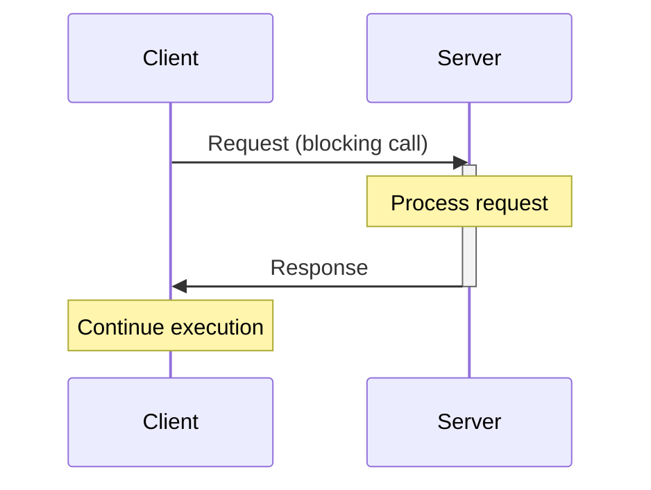
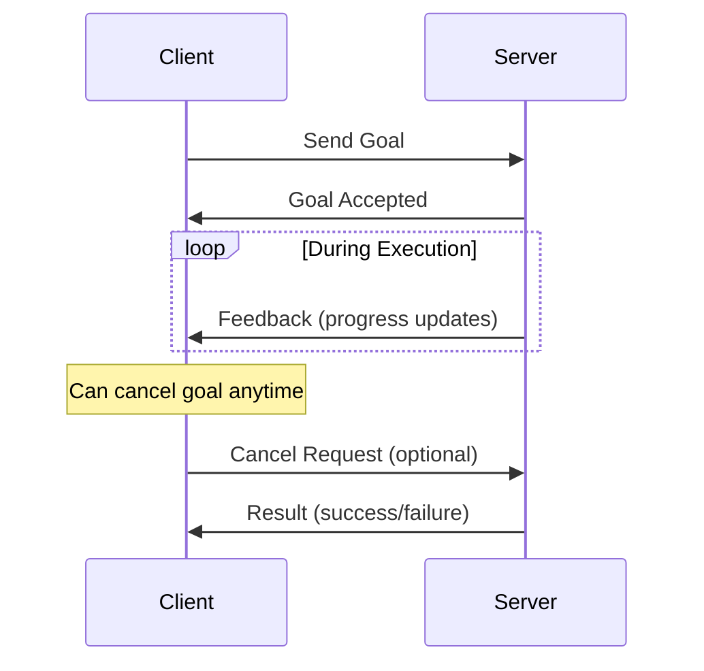

# Chapter 3: Services, Actions, and Parameters

## Learning Objectives

By the end of this chapter, you will be able to:

- Implement ROS 2 services for request-response communication
- Create action servers for long-running tasks with feedback
- Use parameters for runtime configuration
- Choose between topics, services, and actions appropriately
- Handle timeouts, errors, and edge cases gracefully
- Design robust client-server architectures for robot systems

## Introduction

While topics excel at continuous data streams (sensors, state updates), many robot behaviors require different communication patterns:

- **Request-Response**: "Set gripper to 50% open" → "Success"
- **Long-Running Goals**: "Navigate to kitchen" → Feedback: "50% complete" → "Arrived"
- **Configuration**: "What is the camera frame rate?" → "30 FPS"

This chapter introduces **services**, **actions**, and **parameters**—completing your ROS 2 communication toolkit.

## Communication Pattern Comparison

| Pattern | Use Case | Synchronous? | Feedback? | Example |
|---------|----------|--------------|-----------|---------|
| **Topic** | Continuous data streams | No | No | Camera images, odometry |
| **Service** | Request-response | Yes | No | "Get map", "Set LED color" |
| **Action** | Long-running goals | No | Yes | Navigation, grasping, trajectory execution |
| **Parameter** | Configuration | Sync/Async | No | "camera_fps", "wheel_radius" |

## Services: Request-Response Communication

**Services** implement synchronous request-response patterns, similar to function calls or REST APIs.

### Service Architecture



### When to Use Services

✅ **Good Use Cases**:
- Trigger one-time actions: "Take a photo", "Reset odometry"
- Query state: "Get robot pose", "Check battery level"
- Configure sensors: "Set camera exposure", "Change LIDAR resolution"
- Compute transformations: "Transform point from camera to world frame"

❌ **Bad Use Cases**:
- High-frequency data (use topics)
- Long-running tasks (use actions)
- Broadcasting to multiple receivers (use topics)

### Defining Custom Services

Service definitions have two parts: **request** and **response**.

Create `srv/SetGripper.srv`:

```
# SetGripper.srv - Open/close robot gripper

# Request
float32 position        # 0.0 (closed) to 1.0 (open)
float32 max_effort      # Maximum force in Newtons
---
# Response
bool success
string message          # Success or error description
float32 actual_position # Achieved position (may differ from requested)
```

### Implementing a Service Server (Python)

```python
import rclpy
from rclpy.node import Node
from example_interfaces.srv import AddTwoInts  # Built-in service
from my_robot_interfaces.srv import SetGripper  # Custom service

class GripperServer(Node):
    def __init__(self):
        super().__init__('gripper_server')

        # Create service server
        self.srv = self.create_service(
            SetGripper,
            'set_gripper',
            self.handle_set_gripper
        )

        self.get_logger().info('Gripper service ready')

        # Simulated gripper state
        self.current_position = 0.0

    def handle_set_gripper(self, request, response):
        """Service callback - processes request and returns response"""

        self.get_logger().info(
            f'Received request: position={request.position:.2f}, '
            f'effort={request.max_effort:.2f}'
        )

        # Validate input
        if request.position < 0.0 or request.position > 1.0:
            response.success = False
            response.message = 'Position must be between 0.0 and 1.0'
            response.actual_position = self.current_position
            return response

        # Simulate gripper movement (in real system, command hardware)
        try:
            self.command_gripper_hardware(request.position, request.max_effort)
            self.current_position = request.position

            response.success = True
            response.message = 'Gripper moved successfully'
            response.actual_position = self.current_position

        except Exception as e:
            response.success = False
            response.message = f'Hardware error: {str(e)}'
            response.actual_position = self.current_position

        return response

    def command_gripper_hardware(self, position, max_effort):
        """Simulate hardware command (replace with actual driver)"""
        # In real system: send commands to gripper controller
        pass

def main():
    rclpy.init()
    node = GripperServer()
    rclpy.spin(node)
    node.destroy_node()
    rclpy.shutdown()
```

### Calling a Service (Client)

#### Synchronous Client

```python
import rclpy
from rclpy.node import Node
from my_robot_interfaces.srv import SetGripper

class GripperClient(Node):
    def __init__(self):
        super().__init__('gripper_client')

        # Create service client
        self.client = self.create_client(SetGripper, 'set_gripper')

        # Wait for service to be available
        while not self.client.wait_for_service(timeout_sec=1.0):
            self.get_logger().info('Waiting for service...')

    def send_request(self, position, max_effort):
        """Send synchronous service request"""

        # Create request
        request = SetGripper.Request()
        request.position = position
        request.max_effort = max_effort

        # Call service (blocks until response)
        future = self.client.call_async(request)
        rclpy.spin_until_future_complete(self, future)

        if future.result() is not None:
            response = future.result()
            self.get_logger().info(
                f'Result: success={response.success}, '
                f'message={response.message}'
            )
            return response
        else:
            self.get_logger().error('Service call failed')
            return None

def main():
    rclpy.init()
    client = GripperClient()

    # Open gripper to 70%
    client.send_request(position=0.7, max_effort=10.0)

    client.destroy_node()
    rclpy.shutdown()
```

#### Asynchronous Client

```python
class AsyncGripperClient(Node):
    def __init__(self):
        super().__init__('async_gripper_client')
        self.client = self.create_client(SetGripper, 'set_gripper')

    def send_request_async(self, position, max_effort):
        """Send asynchronous service request"""

        request = SetGripper.Request()
        request.position = position
        request.max_effort = max_effort

        # Non-blocking call
        future = self.client.call_async(request)
        future.add_done_callback(self.response_callback)

    def response_callback(self, future):
        """Called when response arrives"""
        try:
            response = future.result()
            self.get_logger().info(
                f'Async result: {response.message}'
            )
        except Exception as e:
            self.get_logger().error(f'Service call failed: {e}')
```

### CLI: Testing Services

```bash
# List available services
ros2 service list
ros2 service list -t  # Show service types

# Get service type
ros2 service type /set_gripper

# Call service from command line
ros2 service call /set_gripper my_robot_interfaces/srv/SetGripper \
  "{position: 0.5, max_effort: 10.0}"
```

## Actions: Long-Running Goals with Feedback

**Actions** are for tasks that take time and require progress updates or cancellation.

### Action Architecture



### When to Use Actions

✅ **Good Use Cases**:
- **Navigation**: "Drive to coordinates (x, y)" with progress updates
- **Manipulation**: "Pick up object" with grasp status feedback
- **Trajectory Execution**: "Follow joint trajectory" with completion percentage
- **Mapping**: "Explore area" with map coverage feedback

❌ **Bad Use Cases**:
- Instant operations (use services)
- Continuous data streams (use topics)

### Defining Custom Actions

Actions have three parts: **goal**, **result**, and **feedback**.

Create `action/Navigate.action`:

```
# Navigate.action - Navigate robot to target pose

# Goal
geometry_msgs/PoseStamped target_pose
float32 speed            # Desired speed (m/s)
---
# Result
bool success
string message
float32 final_distance   # Distance from target
float32 elapsed_time     # Time taken
---
# Feedback
geometry_msgs/PoseStamped current_pose
float32 distance_remaining
float32 estimated_time_remaining
string current_status    # "planning", "moving", "recovering"
```

### Implementing an Action Server

```python
import rclpy
from rclpy.action import ActionServer, CancelResponse, GoalResponse
from rclpy.node import Node
from my_robot_interfaces.action import Navigate
import time

class NavigationActionServer(Node):
    def __init__(self):
        super().__init__('navigation_action_server')

        # Create action server
        self._action_server = ActionServer(
            self,
            Navigate,
            'navigate',
            execute_callback=self.execute_callback,
            goal_callback=self.goal_callback,
            cancel_callback=self.cancel_callback
        )

        self.get_logger().info('Navigation action server ready')

    def goal_callback(self, goal_request):
        """Accept or reject goal"""

        # Validate goal
        target = goal_request.target_pose
        if target.pose.position.x < -100 or target.pose.position.x > 100:
            self.get_logger().warn('Goal rejected: out of bounds')
            return GoalResponse.REJECT

        self.get_logger().info('Goal accepted')
        return GoalResponse.ACCEPT

    def cancel_callback(self, goal_handle):
        """Accept or reject cancel request"""
        self.get_logger().info('Cancel request accepted')
        return CancelResponse.ACCEPT

    async def execute_callback(self, goal_handle):
        """Execute the navigation goal"""

        self.get_logger().info('Executing navigation goal...')
        goal = goal_handle.request

        # Create feedback message
        feedback_msg = Navigate.Feedback()

        # Simulate navigation (in real system: call path planner/controller)
        total_distance = 10.0  # meters
        for i in range(10):
            # Check if goal was canceled
            if goal_handle.is_cancel_requested:
                goal_handle.canceled()
                result = Navigate.Result()
                result.success = False
                result.message = 'Goal canceled by client'
                return result

            # Simulate progress
            progress = (i + 1) / 10.0
            feedback_msg.distance_remaining = total_distance * (1 - progress)
            feedback_msg.estimated_time_remaining = feedback_msg.distance_remaining / goal.speed
            feedback_msg.current_status = 'moving'

            # Publish feedback
            goal_handle.publish_feedback(feedback_msg)
            self.get_logger().info(
                f'Progress: {progress*100:.0f}%, '
                f'{feedback_msg.distance_remaining:.1f}m remaining'
            )

            time.sleep(1)  # Simulate work

        # Success!
        goal_handle.succeed()

        result = Navigate.Result()
        result.success = True
        result.message = 'Navigation completed successfully'
        result.final_distance = 0.1  # Close enough
        result.elapsed_time = 10.0

        return result

def main():
    rclpy.init()
    server = NavigationActionServer()
    rclpy.spin(server)
    server.destroy_node()
    rclpy.shutdown()
```

### Creating an Action Client

```python
import rclpy
from rclpy.action import ActionClient
from rclpy.node import Node
from my_robot_interfaces.action import Navigate
from geometry_msgs.msg import PoseStamped

class NavigationActionClient(Node):
    def __init__(self):
        super().__init__('navigation_action_client')

        # Create action client
        self._action_client = ActionClient(
            self,
            Navigate,
            'navigate'
        )

    def send_goal(self, target_x, target_y, speed):
        """Send navigation goal"""

        # Wait for action server
        self._action_client.wait_for_server()

        # Create goal message
        goal_msg = Navigate.Goal()
        goal_msg.target_pose = PoseStamped()
        goal_msg.target_pose.pose.position.x = target_x
        goal_msg.target_pose.pose.position.y = target_y
        goal_msg.speed = speed

        self.get_logger().info(f'Sending goal: x={target_x}, y={target_y}')

        # Send goal (asynchronous)
        send_goal_future = self._action_client.send_goal_async(
            goal_msg,
            feedback_callback=self.feedback_callback
        )

        send_goal_future.add_done_callback(self.goal_response_callback)

    def goal_response_callback(self, future):
        """Called when server accepts/rejects goal"""

        goal_handle = future.result()
        if not goal_handle.accepted:
            self.get_logger().info('Goal rejected')
            return

        self.get_logger().info('Goal accepted')

        # Wait for result
        result_future = goal_handle.get_result_async()
        result_future.add_done_callback(self.result_callback)

    def feedback_callback(self, feedback_msg):
        """Called when feedback is received"""

        feedback = feedback_msg.feedback
        self.get_logger().info(
            f'Feedback: {feedback.distance_remaining:.1f}m remaining, '
            f'ETA: {feedback.estimated_time_remaining:.1f}s'
        )

    def result_callback(self, future):
        """Called when action completes"""

        result = future.result().result
        self.get_logger().info(
            f'Result: success={result.success}, '
            f'message={result.message}'
        )

def main():
    rclpy.init()
    client = NavigationActionClient()

    # Send goal to navigate to (5, 3) at 0.5 m/s
    client.send_goal(target_x=5.0, target_y=3.0, speed=0.5)

    rclpy.spin(client)
    client.destroy_node()
    rclpy.shutdown()
```

### CLI: Testing Actions

```bash
# List actions
ros2 action list
ros2 action list -t  # Show action types

# Get action info
ros2 action info /navigate

# Send goal from command line
ros2 action send_goal /navigate my_robot_interfaces/action/Navigate \
  "{target_pose: {pose: {position: {x: 5.0, y: 3.0}}}, speed: 0.5}" \
  --feedback
```

## Parameters: Runtime Configuration

**Parameters** are configuration values that can be set at startup or changed at runtime.

### Declaring Parameters

```python
class ConfigurableNode(Node):
    def __init__(self):
        super().__init__('configurable_node')

        # Declare parameters with defaults and descriptions
        self.declare_parameter('camera_fps', 30)
        self.declare_parameter('camera_device', '/dev/video0')
        self.declare_parameter('max_speed', 1.0)
        self.declare_parameter('wheel_radius', 0.05,
            ParameterDescriptor(description='Wheel radius in meters'))

        # Read parameter values
        self.fps = self.get_parameter('camera_fps').value
        self.device = self.get_parameter('camera_device').value

        self.get_logger().info(
            f'Configured: fps={self.fps}, device={self.device}'
        )

        # Register callback for parameter changes
        self.add_on_set_parameters_callback(self.parameter_callback)

    def parameter_callback(self, params):
        """Called when parameters change at runtime"""

        for param in params:
            if param.name == 'camera_fps':
                self.fps = param.value
                self.get_logger().info(f'FPS updated to {self.fps}')
            elif param.name == 'max_speed':
                if param.value < 0.0:
                    return SetParametersResult(successful=False)

        return SetParametersResult(successful=True)
```

### Setting Parameters

**At Launch:**
```bash
ros2 run my_pkg my_node --ros-args \
  -p camera_fps:=60 \
  -p max_speed:=2.0
```

**At Runtime:**
```bash
# Get parameter value
ros2 param get /configurable_node camera_fps

# Set parameter value
ros2 param set /configurable_node camera_fps 60

# List all parameters
ros2 param list /configurable_node

# Dump parameters to file
ros2 param dump /configurable_node > params.yaml

# Load parameters from file
ros2 param load /configurable_node params.yaml
```

### Parameter Files (YAML)

`config/robot_params.yaml`:
```yaml
/my_robot_node:
  ros__parameters:
    camera_fps: 30
    max_speed: 1.0
    wheel_radius: 0.05
    pid_gains:
      kp: 1.0
      ki: 0.1
      kd: 0.05
```

Load in launch file:
```python
from launch import LaunchDescription
from launch_ros.actions import Node

def generate_launch_description():
    return LaunchDescription([
        Node(
            package='my_pkg',
            executable='my_node',
            parameters=['/path/to/robot_params.yaml']
        )
    ])
```

## Choosing the Right Communication Pattern

### Decision Tree

```
Need to send data?
├─ Continuous stream? → **Topic**
├─ One-time request?
│  ├─ Quick (<1s)? → **Service**
│  └─ Long-running?
│     ├─ Need feedback? → **Action**
│     └─ Fire-and-forget? → **Topic**
└─ Configuration? → **Parameter**
```

### Real-World Examples

**Mobile Robot Navigation System:**
```
- Odometry data → Topic (/odom)
- LIDAR scans → Topic (/scan)
- Navigate to goal → Action (/navigate_to_pose)
- Get current map → Service (/get_map)
- Set max speed → Parameter (max_velocity)
```

**Manipulator Control:**
```
- Joint states → Topic (/joint_states)
- Camera images → Topic (/camera/image)
- Execute trajectory → Action (/follow_joint_trajectory)
- Open gripper → Service (/open_gripper)
- Set force limit → Parameter (max_gripper_force)
```

## Error Handling Best Practices

### Services: Timeouts

```python
# Set timeout for service call
future = client.call_async(request)
rclpy.spin_until_future_complete(client, future, timeout_sec=5.0)

if future.done():
    response = future.result()
else:
    client.get_logger().error('Service call timed out')
```

### Actions: Cancellation

```python
# Cancel action goal
goal_handle.cancel_goal_async()
```

### Parameters: Validation

```python
def parameter_callback(self, params):
    for param in params:
        if param.name == 'max_speed':
            if param.value <= 0.0 or param.value > 10.0:
                self.get_logger().error('max_speed must be (0.0, 10.0]')
                return SetParametersResult(successful=False)

    return SetParametersResult(successful=True)
```

## Summary

This chapter completed your ROS 2 communication toolkit:

✅ **Services**: Request-response for quick operations
✅ **Actions**: Long-running goals with feedback and cancellation
✅ **Parameters**: Runtime configuration and tuning
✅ **Pattern Selection**: Choose the right tool for each job
✅ **Error Handling**: Timeouts, validation, graceful failures

You now have all the communication patterns needed to build complex robotic systems. In the next module, we'll explore simulation environments for testing these concepts.

## Exercises

1. **Service Implementation**: Create a `TakePicture` service that accepts quality settings and returns an image file path.

2. **Action Server**: Implement a `ChargeB attery` action with feedback showing charge percentage and estimated time remaining.

3. **Parameter Tuning**: Create a PID controller node with tunable gains (kp, ki, kd) as parameters. Test parameter changes at runtime.

4. **Pattern Comparison**: For the following scenarios, choose topic/service/action and justify:
   - Sending velocity commands to motors (100 Hz)
   - Requesting robot's current battery level
   - Executing a multi-waypoint patrol route
   - Streaming LIDAR data at 10 Hz

5. **Error Handling**: Modify an action server to handle cancellation gracefully and return partial results.

## Further Reading

- **Services**: [Understanding Services](https://docs.ros.org/en/humble/Tutorials/Beginner-CLI-Tools/Understanding-ROS2-Services/Understanding-ROS2-Services.html)
- **Actions**: [Understanding Actions](https://docs.ros.org/en/humble/Tutorials/Beginner-CLI-Tools/Understanding-ROS2-Actions/Understanding-ROS2-Actions.html)
- **Parameters**: [Understanding Parameters](https://docs.ros.org/en/humble/Tutorials/Beginner-CLI-Tools/Understanding-ROS2-Parameters/Understanding-ROS2-Parameters.html)
- **Design Patterns**: [ROS 2 Design](https://design.ros2.org/)

---

**Next Module**: [Simulation with Gazebo and Unity](/docs/modules/03-simulation/) — Test your ROS 2 knowledge in virtual environments.
